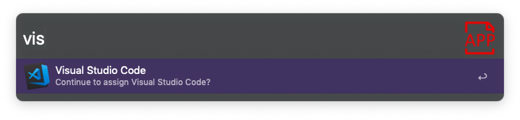

# Default App for Alfred

**Default App** changes the assigned app for a specific extension.

## Dependencies

**Default App** uses [duti](https://github.com/moretension/duti) to change assigned apps. 

You need to install *duti* first before you execute the Alfred Workflow

````
brew install duti
````
## Usage

`dapp` *ext*

1. *ext* you can type any extension, the worfklow will ask for confirmation in case the extension is unknown. 
2. Choose one of the App to assign the extension to. 

## Screenshots

### 1. Step


### 2. Step



### 3. Step
